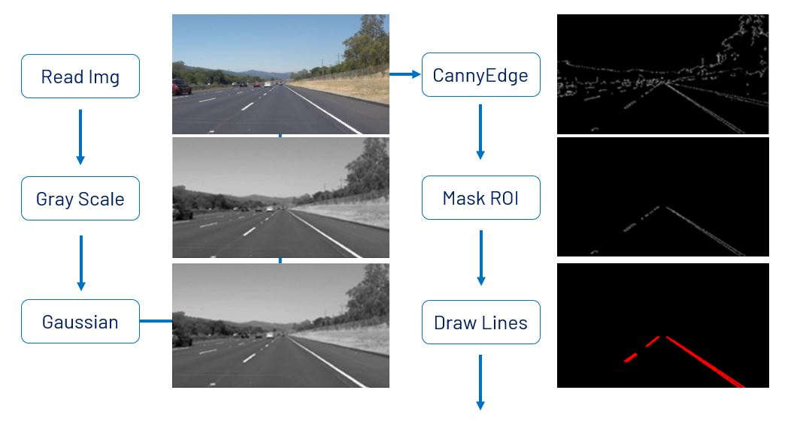
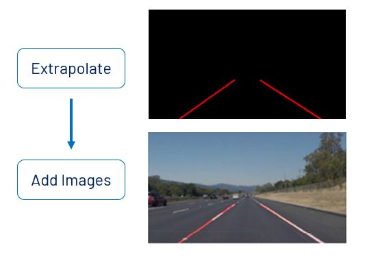
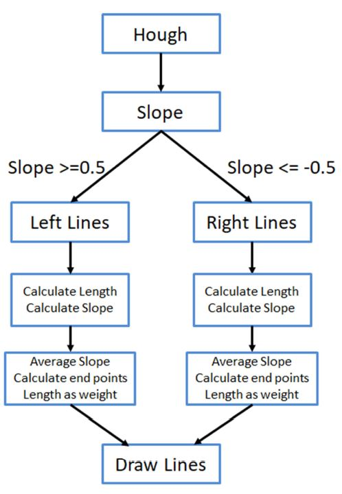

# Udacity-CarND-LaneLines
  
This project was developed on windows 10 with Anaconda, jupyter notebook installed.  

## Dependencies  
* matplotlib  
* opencv

## Image Process Pipeline
  
  

## Line Extrapolation  
 

## Shortcoming  
While extrapolating lines, only slope are considered as threshold to
categorized points set into left or right group. Which means the outputs can be
sever influence by road signs, cars ahead and split lane lines or any objects
with edges can pass Hough transformation criteria.
